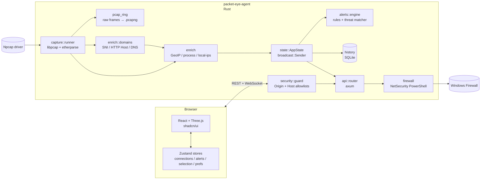

# Architecture

## Threading model

| Thread | Source | Job |
|---|---|---|
| `tokio` runtime (main) | `#[tokio::main]` | axum HTTP/WS, all async handlers. |
| `packet-eye-capture` | `std::thread::Builder` in `Runner::spawn` | Blocking pcap loop. Pulls one packet at a time, parses with etherparse, calls a synchronous callback. |
| `packet-eye-procmap` | `ProcessResolver::spawn_refresher` | Refreshes the `(port, proto) → PID → name` table every 2 s using the Win32 IP helper API. |
| `packet-eye-localips` | inline thread in `lib.rs::run` | Re-enumerates local IPs every 30 s. |
| Many tokio tasks | per-WebSocket | One task per connected browser, fans out the broadcast channels. |
| History tasks | `spawn_history_tasks` | Flush the per-minute aggregate to SQLite every 10 s, purge expired rows hourly. |
| Blocking pool | `spawn_blocking` | SQLite queries, PowerShell firewall calls, threat-list reloads. |

The capture thread is **blocking by design** — `Capture::next_packet`
is synchronous. The enrichment is fast (DashMap + LRU lookups), so we
don't async-park it. The output is pushed into a `tokio::broadcast`
channel that `axum` handlers happily consume.

## Data flow

1. Npcap wakes the capture thread with a frame.
2. `parse_packet` decodes Ethernet/IP/TCP-or-UDP-or-ICMP layers and
   produces a `PacketEvent` (with the first 256 bytes hex-encoded for
   the inspector).
3. The capture callback enriches it (`Enricher::enrich`):
   - GeoIP city + ASN lookup on the public side.
   - Local-IPs set classifies the direction (in/out/unknown).
   - Process map gives owner name + PID.
4. Enriched packets are batched (≥ 4096 packets or every 500 ms) then
   `tx.send(batch)` fans them out to all WS subscribers.
5. The alert engine evaluates each enriched packet **after** publish
   (so the UI sees both the connection and the alert in the same
   tick) and emits via the `alert_tx` channel.
6. Stats counters tick every second on the same channel pair.

## Frontend store layout

| Store | Source | Holds |
|---|---|---|
| `connectionsStore` | WS `packets` + `stats` | `recentPackets` ring buffer + aggregated `connections` map + global stats. |
| `alertsStore` | WS `alerts` | Bounded ring of the latest 200 alerts. |
| `selectionStore` | UI events | Currently selected connection ID + hovered ID. |
| `prefsStore` | localStorage | Sound config (enabled, volume, per-severity). |

Components read narrow slices via Zustand selectors so unrelated state
changes don't re-render the heavy 3D scene.

## Why a separate agent?

A browser cannot read raw packets — that's a kernel-level capability
behind the Npcap driver, only exposed to admin-level user-space
processes. The agent is the "thin admin layer" that exposes the data
to a non-privileged web context via a strict same-origin / loopback
API. The browser then handles all the UX without ever escalating.
